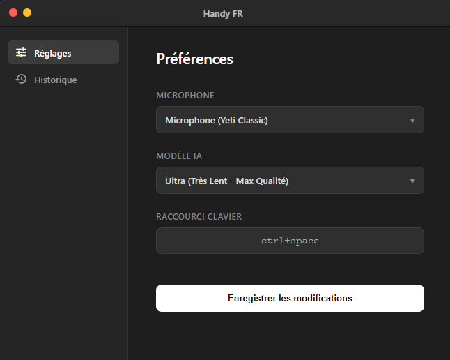

# 🎙️ Handy FR - Assistant Vocal IA Local & Invisible

   

Handy FR est un assistant de bureau ultra-rapide qui transforme votre voix en texte instantanément, dans n'importe quelle application Windows. 

Contrairement aux solutions cloud (Siri, Google), **Handy tourne 100% en local** sur votre machine grâce au modèle **Whisper**. Vos données ne quittent jamais votre PC.


*(Tableau de bord de configuration : Choix du modèle IA, Micro et Raccourcis)*

## ✨ Pourquoi utiliser Handy ?

- **🔒 Confidentialité Totale :** Aucune donnée n'est envoyée dans le cloud. Confidentialité totale.
- **⚡ Performance GPU :** Optimisé pour les cartes Nvidia (CUDA) via `Faster-Whisper`.
- **👻 Mode Fantôme :** L'application tourne en tâche de fond sans fenêtre gênante.
- **✍️ Dictée Universelle :** Placez votre curseur dans Word, Discord, ou un mail, appuyez sur le raccourci et parlez. Le texte s'écrit tout seul.
- **⚙️ Configurable :** Changez la puissance du modèle (Tiny à Large-v3) et vos raccourcis à la volée.

## 🛠️ Pré-requis

- **OS :** Windows 10 ou 11.
- **Python :** Version 3.10 ou supérieure.
- **Node.js :** Pour l'interface graphique.
- **GPU (Recommandé) :** Carte graphique Nvidia pour une transcription instantanée. (Fonctionne aussi sur CPU, mais plus lentement).

## 🚀 Installation

### 1. Cloner le projet
```bash
git clone [https://github.com/simonw31/Speech-to-text-local.git](https://github.com/simonw31/Speech-to-text-local.git)
cd Speech-to-text-local
```

### 2. Installation du Backend (Python)
C'est le "cerveau" de l'IA.
```bash
# Créer l'environnement virtuel (isolé)
python -m venv venv

# Activer l'environnement
venv\Scripts\activate

# Installer les dépendances
pip install -r backend/requirements.txt
```
*Note pour les utilisateurs Nvidia : Si `faster-whisper` ne détecte pas votre GPU, assurez-vous d'avoir installé les drivers CUDA 11 ou 12.*

### 3. Installation du Frontend (Electron)
C'est le "visage" de l'application.
```bash
cd frontend
npm install
```

## 🎮 Utilisation

### Méthode 1 : Lancement pour le développement (Visible)
Double-cliquez sur le fichier `HandyFR.bat`. Une fenêtre de console s'ouvrira pour vous montrer les logs de l'IA.

### Méthode 2 : Mode "Invisible" (Quotidien)
1. Utilisez le fichier `Lancer_Invisible.vbs` à la racine.
2. Rien ne s'affiche ? C'est normal ! Regardez dans votre barre des tâches (près de l'heure), une petite icône blanche est apparue.
3. Pour lancer Handy au démarrage de Windows : Créez un raccourci de ce fichier `.vbs` et placez-le dans le dossier `shell:startup`.

### Comment dicter ?
1. Mettez votre curseur où vous voulez écrire.
2. Maintenez **`Ctrl + Espace`** (raccourci par défaut).
3. Parlez distinctement.
4. Relâchez les touches : L'IA transcrit et tape le texte pour vous.

## 🔧 Dépannage Courant

**Erreur "Port 8000 already in use" :**
L'application tourne déjà en fond. Ouvrez le Gestionnaire des tâches et tuez les processus `python.exe` ou `electron.exe`.

**L'IA est lente :**
Vérifiez dans le Dashboard si vous utilisez un modèle trop gros pour votre PC (ex: "Large-v3" sur un CPU). Essayez le modèle "Base" ou "Small".

**Caractères bizarres (Encoding) :**
Le projet force l'UTF-8, mais assurez-vous que votre terminal Windows est compatible si vous lancez en mode dev.

## 🏗️ Stack Technique

* **Backend :** Python, FastAPI, Uvicorn, Faster-Whisper, PyAudio.
* **Frontend :** Electron, HTML5, CSS3 (Vanilla JS pour la performance).
* **Communication :** API REST locale (localhost:8000).

## 🗺️ Roadmap : Vers une v2.0

Le projet est fonctionnel mais utilise des méthodes "brutes" pour le moment. L'objectif est de professionnaliser l'architecture technique.

| Statut | Catégorie | Tâche | Détails |
| :--- | :--- | :--- | :--- |
| ⬜ | **Distribution** | Création d'un installateur (.exe) | Remplacer le lancement via `.bat` et `.vbs` par un vrai installateur Windows (via *Electron Forge* ou *PyInstaller*). |
| ⬜ | **Frontend** | Refonte React/Vite | Migrer l'interface vanilla JS vers **React + Tailwind** pour une meilleure gestion d'état et un design plus robuste. |
| ⬜ | **Core** | Streaming Temps Réel | Afficher le texte **pendant** que l'utilisateur parle (comme la dictée Siri) au lieu d'attendre la fin de la phrase. |
| ⬜ | **Compatibilité** | Support Multi-GPU | Optimiser le backend pour supporter officiellement les GPU AMD (ROCm) et les puces Apple Silicon, en plus de Nvidia. |
| ⬜ | **IA** | Post-traitement Intelligent | Connecter un petit LLM local pour corriger automatiquement la ponctuation et les hésitations ("euh...") après la transcription. |
| ⬜ | **UX** | Auto-Updater | Intégrer un système de mise à jour automatique pour ne plus avoir à `git pull` manuellement. |

*Légende : ✅ Fait | 🚧 En cours | ⬜ À faire*

---

---
*Développé avec ❤️ pour la productivité locale.*
